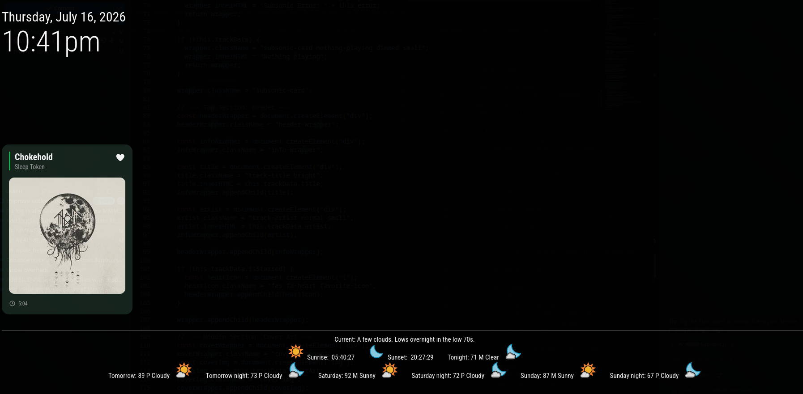

# MMM-Navidrome


A standalone [MagicMirror²](https://github.com/MichMich/MagicMirror) module to display the currently playing track from [Navidrome](https://www.navidrome.org/) or any Subsonic API-compatible media server. 

## Screenshot



## Features

* **Polished Card Layout:** A modern, iOS-widget style stacked layout with a deep dark background and a subtle green accent bar.
* **Favorites Indicator:** Automatically renders a clean heart icon next to the track title if you have starred/favorited the song on your server.
* **Track Duration:** Displays a clean, static timer showing the total track length without layout-jitter.
* **Text Wrapping:** Automatically handles long track names and artists by wrapping cleanly to a second line before applying a graceful truncation.
* **Secure Backend Authentication:** Communicates with the Subsonic API via the `node_helper.js` backend. It generates a secure salted MD5 hash for your password, ensuring your raw credentials are never leaked to the browser's DOM or console.
* **Lightweight:** Zero external npm dependencies. Uses native Node.js `crypto` and `fetch`.
* **Configurable Logging:** Centralized backend tracking that keeps your server logs clean, defaulting to `warn` but providing a deep `debug` toggle when troubleshooting.


## Installation

1. Navigate to your MagicMirror `modules` directory:
   ```bash
   cd ~/MagicMirror/modules
   ```
2. Clone this repository:
   ```bash
   git clone https://github.com/death2all110/MMM-Subsonic.git
   ```

*(Note: If you manage your MagicMirror instance through an Unraid template or similar volume-mapped setup, make sure you clone this repository directly into your mapped `modules` share/directory so it persists across restarts.)*

## Configuration

To activate the module, add the following block to your `config/config.js` array. 

```javascript
{
  module: "MMM-Subsonic",
  position: "bottom_left", // Choose your preferred location
  config: {
    url: "http://192.168.1.100:4533", // REQUIRED: The full URL to your server (include http/https and port)
    username: "YOUR_USERNAME",        // REQUIRED: Your Navidrome username
    password: "YOUR_PASSWORD",        // REQUIRED: Your Navidrome password
    
    // Optional Settings
    updateInterval: 10000,            // How often to poll the API in milliseconds (Default: 10000)
    apiVersion: "1.16.1",              // Subsonic API version to request (Default: "1.16.1")
    logLevel: "warn"                  // Set log level. Defaults to 'warn'
  }
}
```

## Styling

This module includes a default `MMM-Subsonic.css` file that provides the rounded card structure and text handling.

If you want to customize the appearance (e.g., changing the background color, shifting the green accent line color, or adjusting the overall card width), it is highly recommended to add your overrides to the main MagicMirror `css/custom.css` file rather than modifying the module's CSS file directly. This ensures your changes aren't overwritten when you pull future updates from GitHub.

## Troubleshooting

* **Module is stuck on "Nothing playing":** Ensure that a client is actively playing or paused on your Subsonic account. The API `getNowPlaying` endpoint only returns data for active streams.
* **"Subsonic Error: HTTP error 404/500":** Double-check your `url` in the config. Make sure you don't have an unintended trailing slash, and verify the port is correct.
* **Debugging API data:** Switch `logLevel` to `"debug"` in your config and check your MagicMirror container or PM2 server logs to inspect the raw incoming JSON payload from your media server.

## Troubleshooting

* **Module is stuck on "Nothing playing":** Ensure that a client is actively playing or paused on your Navidrome account. The Subsonic API `getNowPlaying` endpoint only returns data for active streams.
* **"Subsonic Error: HTTP error 404/500":** Double-check your `url` in the config. Make sure you don't have an unintended trailing slash, and verify the port is correct.
* **Debugging API data:** Switch `logLevel` to `"debug"` in your config and check your MagicMirror container or PM2 server logs to inspect the raw incoming JSON payload from your media server.
* **Authentication Errors:** Verify your username and password. The module securely hashes your password using the method required by the Subsonic API standard.

## License

MIT License